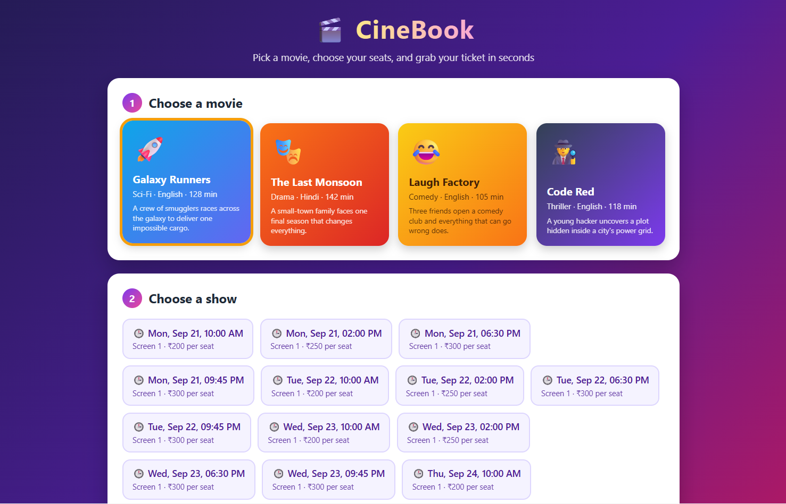

# Movie Booking System

A movie ticket booking system built with **Java 17, Spring Boot 3 and Spring Data JPA**, with a colorful web front-end. Browse movies, pick a show, choose your seats on a seat map, and get a booking code.

**Live demo:** [add your Render link here]

> Note: this runs on a free instance. The first load can take 1 to 2 minutes to wake up, and bookings reset when the app restarts.

## Screenshot


## Features
- Browse movies and upcoming shows
- Interactive seat map with booked seats disabled
- Book up to 10 seats at once and get a booking code
- **Double-booking protection**: a database unique constraint on show and seat stops two people from booking the same seat, even at the same moment
- Look up a booking by code
- Cancel a booking, which frees the seats
- Input validation and clean JSON error responses
- Sample movies and shows are seeded automatically at startup

## Tech Stack
- Java 17
- Spring Boot 3 (Web, Data JPA, Validation)
- H2 in-memory database
- HTML, CSS, JavaScript
- Maven
- Docker

## API Endpoints
| Method | Endpoint | Description |
|--------|----------|-------------|
| GET | `/api/movies` | List movies |
| GET | `/api/movies/{id}/shows` | List shows for a movie |
| GET | `/api/shows/{id}/seats` | Seat map with booked seats |
| POST | `/api/bookings` | Book seats |
| GET | `/api/bookings/{code}` | View a booking |
| DELETE | `/api/bookings/{code}` | Cancel a booking |

Example request:

```json
POST /api/bookings
{
  "showId": 1,
  "customerName": "Om",
  "customerEmail": "om@example.com",
  "seats": ["A1", "A2"]
}
```

## Run Locally
Requirements: Java 17+ and Maven.

```bash
git clone https://github.com/omcontributes/movie-booking.git
cd movie-booking
mvn spring-boot:run
```

Then open http://localhost:8082

## Project Structure
```
src/main/java/com/example/moviebooking
├── config       Sample data seeding
├── controller   REST endpoints
├── service      Booking and catalog logic
├── model        JPA entities
├── repository   Database access
├── dto          Request and response objects
└── exception    Custom exceptions and global handler
```

## How Double-Booking Is Prevented
1. The service first checks whether any requested seat is already taken.
2. If two requests pass that check at the same time, the database's unique constraint on (show, seat) rejects the second one.
3. The service turns that into a clear "seats were just booked" message.

## Future Improvements
- PostgreSQL for persistent storage
- User accounts and login
- Payment integration
- Email confirmation for bookings

## Author
**Om Amrale** - [GitHub](https://github.com/omcontributes)